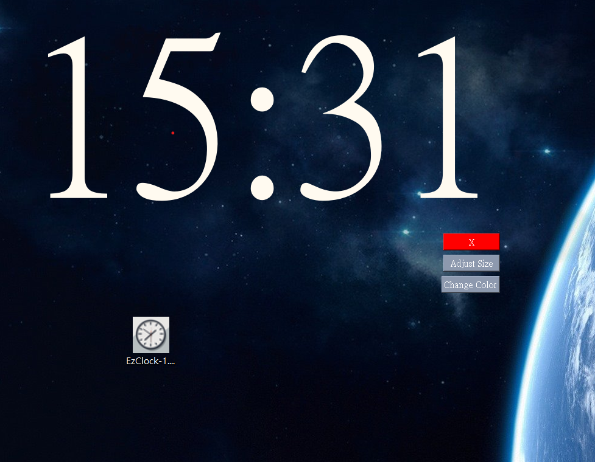

# A Clock Widget for PC USER

I need a clock for my desktop, so my best friend GPT and I built an EzClock widget with Python.

# Install requirement

`python -m pip install -r requirements.txt`

# Compile

install python compile tool:

`pip install pyinstaller`

compile:

`pyinstaller --onefile --icon "res/icon.ico" --hide-console hide-early  --noconsole -F --add-data "res;res" clock.py`

## Troubleshooting

If the icon is not change,just rename the file,then File explorer will update the icon.